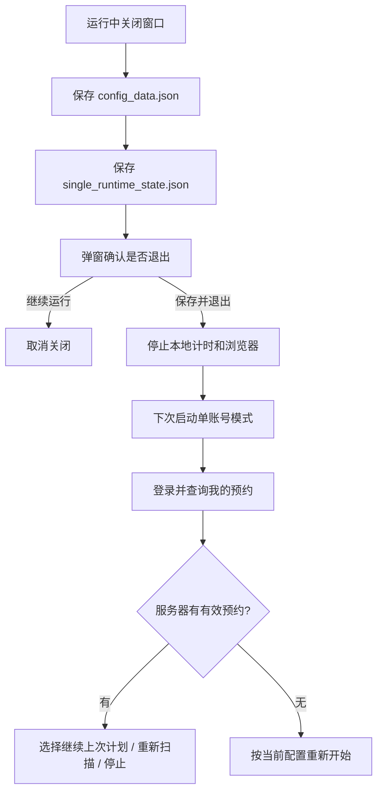

<div align="center">

<table border="0" cellpadding="0" cellspacing="0">
<tr>
<td width="180" align="center" valign="middle">

</td>
<td valign="middle" align="left">

# LNU-LibSeat

### 辽宁大学图书馆座位预约助手 · v2.0.0

基于 PySide6 图形界面、LibSeat API 扫描规划和 Selenium 自动预约，支持单账号逐段换座、多账号分时段、跨房间搜索、运行恢复和首次帮助引导。

<p>


</p>

</td>
</tr>
</table>

</div>

---

> [!IMPORTANT]
> 本项目会执行真实预约、取消和换座操作。第一次配置请先开启“测试模式”，确认扫描方案合理后再执行真实预约。

> [!WARNING]
> 请遵守图书馆预约、签到和取消规则。使用者需要自行承担预约失败、未签到、违约或黑名单等后果。

> [!TIP]
> 第一次启动会自动弹出使用帮助。之后可以点击标题栏右上角的 `?` 按钮再次查看。

---

## 这是什么

LNU-LibSeat 是一个面向辽宁大学图书馆座位预约系统的桌面工具。它不是单纯的定时抢座脚本，而是更偏“座位预约助手”：帮你在当前可预约时间段里扫描、比较、筛选，并预约更合适的座位。

- 先通过 API 快速扫描座位可用时间。
- 再让用户确认推荐方案。
- 最后通过 Selenium 浏览器流程完成真实预约。
- 单账号模式下，可在当前预约结束前自动查找下一段座位，并在确认后取消当前预约、预约新座位。
- 误关程序后，下次启动可查询“我的预约”并继续上次计划。

## 适合谁

| 使用者 | 典型需求 | 推荐模式 |
| --- | --- | --- |
| 普通预约用户 | 只想预约一段固定时间，例如 `09:00-12:00` | 单账号预约 |
| 长时间自习用户 | 想覆盖 `09:00-21:00`，但单个座位无法连续覆盖 | 单账号逐段 |
| 多账号分段用户 | 希望多个账号分别覆盖不同时间段 | 多账号分时段 |
| 调试/观察用户 | 想先看看有哪些可用座位，不想执行真实操作 | 测试模式 |

---

## 🔍 和 06:30 定时抢座工具有什么不同

这个项目受到 [XUNRANA/LNU-LibSeat-Automation](https://github.com/XUNRANA/LNU-LibSeat-Automation/) 的启发，但定位不同：

| 对比项 | XUNRANA/LNU-LibSeat-Automation | 本项目 LNU-LibSeat |
| --- | --- | --- |
| 核心目标 | 程序保持运行，计划在 `06:30` 抢第一批放出的、用户指定序号/时间的座位。 | 面向日常预约助手，帮助用户扫描当前可预约时间段，筛选合适座位并完成预约。 |
| 使用场景 | 提前配置，等待固定放座时刻自动提交。 | 打开后按当前时间、目标时段、跨房间和偏好座位生成推荐方案。 |
| 长时间学习 | 更偏定时抢指定座位。 | 支持单账号逐段：第一段结束前自动查找下一段，确认后换座。 |
| 用户交互 | 更强调无人值守抢座。 | 更强调“先看方案、再确认”，适合日常选择和规划。 |
| 恢复机制 | 以保持程序运行和会话追踪为主。 | 运行中关闭会保存状态，重启后查询“我的预约”并询问是否继续。 |

验证码模块和一些实现灵感来自 XUNRANA 的项目。感谢他开源了完整思路和实践经验；本项目在此基础上重新做了偏“预约筛选助手”的功能取向。

---

## 💡 核心能力

<table width="100%">
<tr>
<td width="33%" valign="top">
<h3>API 扫描规划</h3>
通过后端接口扫描房间、座位和可预约时间段，生成推荐方案和 JSON 报告，减少逐个点击座位的等待。
</td>
<td width="33%" valign="top">
<h3>单账号逐段换座</h3>
先预约第一段，再按“提前 N 分钟”查找下一段。找到后弹窗确认，或开启自动模式直接换座。
</td>
<td width="33%" valign="top">
<h3>关闭后可恢复</h3>
运行中关闭会先保存状态。重启登录后查询“我的预约”，可选择继续上次计划、重新扫描或停止。
</td>
</tr>
<tr>
<td width="33%" valign="top">
<h3>多账号分时段</h3>
最多 3 个账号分别预约不同时间段，适合覆盖较长的学习安排。
</td>
<td width="33%" valign="top">
<h3>跨房间搜索</h3>
目标房间没有合适方案时，可扫描勾选的其他房间，并按时间长度和策略推荐。
</td>
<td width="33%" valign="top">
<h3>首次帮助和主题</h3>
首次打开自动展示使用说明。支持亮色/暗色主题切换，重启后完整生效。
</td>
</tr>
</table>

---

## 🧪 功能怎么玩：几个具体例子

### 🎯 例子 1：我只想马上找一个合适座位

🎯 场景：现在是上午，你想预约 `10:00-13:00`，不执着于某一个座位，只想尽快找到可用时间长的位置。

1. 选择校区和目标房间。
2. 设置时间段 `10:00-13:00`。
3. 开启“测试模式”先扫描。
4. 看日志里的 API 推荐方案。
5. 关闭测试模式，确认后真实预约。

适合：临时去图书馆、自习一上午或一下午。

### 💺 例子 2：我有心仪座位，但也接受兜底

💺 场景：你更想坐 `185`、`186`，但如果它们不可用，也愿意接受同房间别的长时间座位。

1. 在优先座位里填入 `185`、`186`。
2. 策略选择“优先座位优先”。
3. 程序会优先检查这些座位。
4. 如果优先座位不可用，会回退到可用时间更长的座位。

适合：有固定学习习惯，但不想手动一个个点座位。

### 📚 例子 3：我想从早坐到晚，但一次约不满

📚 场景：你目标是 `09:00-21:00`，但系统限制单次预约时长，或者没有座位能连续覆盖。

1. 选择“单账号逐段”。
2. 设置 `09:00-21:00`。
3. 设置提前 `30` 分钟查找下一座位。
4. 程序先预约第一段，例如 `09:00-14:00`。
5. 到 `13:30` 自动扫描 `14:00` 之后的下一段。
6. 找到后弹窗告诉你下一段座位、房间和时间。
7. 你确认后，程序取消当前预约并预约新座位。

适合：考研、自习、长期在馆学习。

### 🏛️ 例子 4：当前房间不理想，想看看附近房间

🏛️ 场景：目标房间只有短时间座位，但你愿意去二楼/三楼其他房间。

1. 开启“跨房间搜索”。
2. 只勾选你愿意去的房间。
3. 程序会比较当前房间和跨房间候选。
4. 如果跨房间候选明显更长，会推荐并提示你确认。

适合：比起固定房间，更看重连续学习时间。

### 🧭 例子 5：我怕误关程序

🧭 场景：单账号逐段运行中，你不小心点了关闭。

1. 程序会先保存当前预约和下一次扫描计划。
2. 弹窗提醒你任务仍在运行。
3. 如果确认退出，下次启动后会登录并查询“我的预约”。
4. 如果仍有有效预约，会让你选择继续上次计划、重新扫描或停止。

适合：长时间挂机但担心误操作的用户。

---

## 🚀 快速开始

### 方式一：运行打包版

1. 下载或构建 `dist/LNU-LibSeat-v2.0.0.zip`。
2. 解压到任意目录。
3. 双击 `LNU-LibSeat.exe`。
4. 阅读首次帮助窗口。
5. 填写账号、校区、房间和目标时间段。
6. 第一次建议开启“测试模式”，点击开始查看方案。
7. 确认无误后关闭测试模式，执行真实预约。

### 方式二：源码运行

```powershell
cd LNU-LibSeat
.\run.bat
```

`run.bat` 会自动创建 `env` 虚拟环境、安装依赖并启动 GUI。

已安装依赖时，也可以运行：

```powershell
env\Scripts\python.exe app.py
```

---

## 🖼️ 界面预览

### 主界面


### 首次帮助窗口


### 单账号、多账号、跨房间和优先座位配置


### 测试模式和 API 方案日志


### 运行日志检测


### 主题切换

<table width="100%">
<tr>
<td width="50%" align="center">

</td>
<td width="50%" align="center">

</td>
</tr>
</table>

---

## 🔁 单账号逐段预约示例

假设你想从 `09:00` 坐到 `21:00`，但系统单个座位最长只能预约一段，或没有座位能完整覆盖全天。

1. 选择“单账号逐段”。
2. 设置时间段 `09:00-21:00`。
3. 设置“提前 30 分钟开始查找下一座位”。
4. 程序先预约第一段，例如 `09:00-14:00`。
5. 到 `13:30`，程序开始扫描 `14:00` 之后的下一段。
6. 找到后弹窗展示下一段座位、房间和时间。
7. 点击确认后，程序取消当前预约并预约新座位。

如果勾选“自动取消并换座”，找到下一段后会跳过确认直接执行。第一次使用不建议开启自动模式。

---

## 🛟 关闭和恢复

单账号逐段运行时，程序会保存运行状态：



恢复时以服务器“我的预约”查询结果为准。本地保存的信息只用于展示上次记录、恢复计时计划和优先验证上次第二段候选。

---

## 🙏 致谢与功能区分

特别感谢 [XUNRANA/LNU-LibSeat-Automation](https://github.com/XUNRANA/LNU-LibSeat-Automation/)。

这个项目的验证码模块和一些工程灵感来自他的开源项目，包括图形界面组织、验证码处理思路和自动化预约经验。没有这些参考，本项目会少走很多路。

同时需要说明：两个项目的功能定位不同。

- XUNRANA 的项目更像“定时抢座器”：保持程序运行，等待 `06:30` 放座，抢用户预先指定时间和序号的座位。
- 本项目更像“预约筛选助手”：根据当前时间、目标时间段、房间、跨房间范围和偏好座位，帮用户扫描并挑选更合适的座位；同时支持单账号逐段续约/换座和关闭恢复。

如果你需要的是固定放座时刻的第一批座位抢占，可以了解 XUNRANA 的项目；如果你需要的是日常查询、筛选、预约和长时段逐段安排，可以使用本项目。

---

## 📚 文档导航

| 文档 | 内容 |
| --- | --- |
| [文档中心](docs/README.md) | 所有文档入口。 |
| [快速开始](docs/QUICKSTART.md) | 从运行到第一次测试。 |
| [用户使用指南](docs/USER_GUIDE.md) | 普通预约、单账号逐段、多账号分时段。 |
| [配置说明](docs/CONFIGURATION.md) | 配置文件和字段含义。 |
| [架构说明](docs/ARCHITECTURE.md) | 模块职责和运行链路。 |
| [预约与恢复流程](docs/FLOWS.md) | Mermaid 流程图。 |
| [恢复机制详解](docs/RECOVERY_AND_STATE.md) | `single_runtime_state.json` 和恢复策略。 |
| [打包与发布](docs/BUILD_AND_RELEASE.md) | PyInstaller 打包和 GitHub 上传建议。 |
| [常见问题](docs/FAQ.md) | 常见问题和排查建议。 |

---

## 🧱 项目结构

```text
LNU-LibSeat/
├── app.py                         # 程序入口
├── run.bat                        # 一键源码运行
├── build.py                       # Windows 打包脚本
├── build_exe.bat                  # Windows 一键打包入口
├── config.py                      # 默认/旧版配置
├── config_data.json               # GUI 配置数据
├── core/                          # API、驱动、通知、验证码、日志等基础能力
├── logic/                         # 登录、导航、预约、取消、规划等业务逻辑
├── ui/                            # PySide6 GUI、面板、控件和后台 worker
│   ├── main_window.py             # 主窗口、帮助、主题、关闭恢复检测
│   ├── runtime_state.py           # 单账号恢复状态读写
│   ├── panels/
│   ├── widgets/
│   └── workers/alloc_worker.py    # 核心后台流程
├── info/                          # 房间和座位信息
├── docs/                          # 项目文档
├── logs/                          # 运行日志和 API 报告
└── requirements.txt               # Python 依赖
```

---

## 📦 打包

```powershell
.\build_exe.bat
```

默认产物：

| 产物 | 路径 |
| --- | --- |
| 发行目录 | `dist/LNU-LibSeat-v2.0.0/` |
| 压缩包 | `dist/LNU-LibSeat-v2.0.0.zip` |
| exe | `dist/LNU-LibSeat-v2.0.0/LNU-LibSeat.exe` |

自定义版本或发行名：

```powershell
.\build_exe.bat --app-version v2.1.0
.\build_exe.bat --dist-name 给同学用的座位工具
```

---


## ⚖️ 免责声明

本项目仅供技术学习和个人使用。请遵守学校图书馆座位预约、签到和取消规则。由于使用本工具造成的预约失败、违约、黑名单、账号异常或其他后果，由使用者自行承担。

## License

[MIT](LICENSE)
