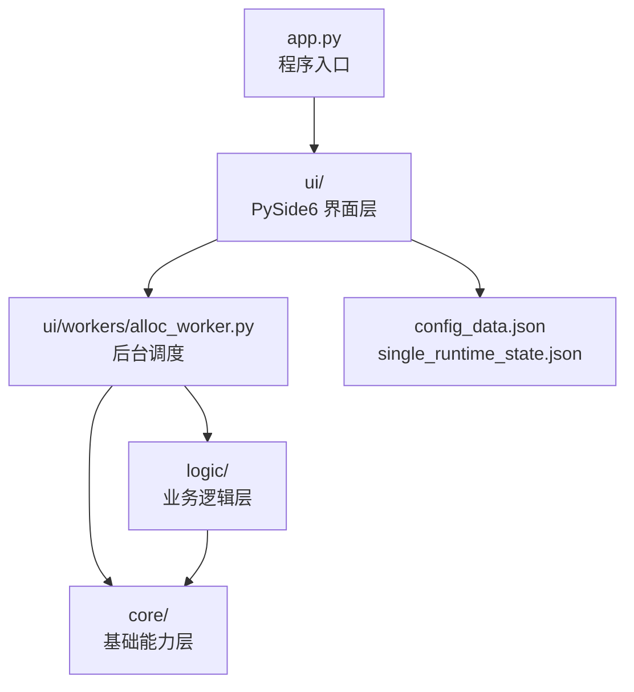
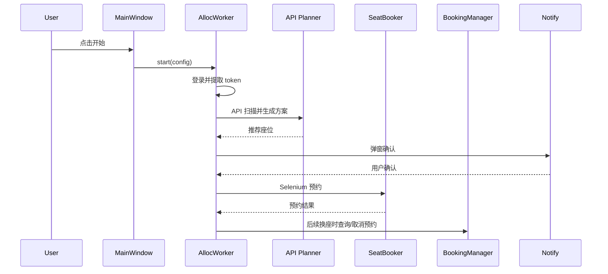

# 架构说明

[返回文档中心](README.md)

## 分层结构

## 层级职责

| 层级 | 主要文件 | 职责 |
| --- | --- | --- |
| 入口层 | `app.py`, `run.bat` | 启动程序、准备工作目录、创建 Qt 应用。 |
| UI 层 | `ui/main_window.py`, `ui/panels/*`, `ui/widgets/*` | 展示配置、日志、帮助、续约计划状态、状态栏、操作按钮和低动画模式。 |
| Worker 层 | `ui/workers/alloc_worker.py` | 调度登录、API 扫描、候选/方案选择、预约、取消、换座、恢复和通知。 |
| 业务层 | `logic/*` | 登录、进房间、预约、取消、时间规划。 |
| 基础层 | `core/*` | API、浏览器驱动、日志、通知、验证码、路径。 |
| 数据层 | `config_data.json`, `single_runtime_state.json`, `info/*` | 用户配置、运行恢复状态、房间座位数据。 |

## 关键模块

| 模块 | 说明 |
| --- | --- |
| `ui/main_window.py` | 主窗口。处理首次帮助、主题切换、低动画切换、启动/停止、续约计划倒计时、关闭防误关和启动恢复提示。 |
| `ui/workers/alloc_worker.py` | 核心后台流程。包含测试模式、多账号多方案、单账号逐段和恢复逻辑。 |
| `ui/runtime_state.py` | 保存、读取、清理单账号恢复状态。 |
| `logic/api_planner.py` | API-only 扫描、可选候选、多账号多方案和单账号后续预案生成。 |
| `logic/booking_manager.py` | 查询“我的预约”、取消当前预约、返回座位图。 |
| `logic/booker.py` | Selenium 座位预约和验证码处理。 |
| `core/api_client.py` | LibSeat 后端接口请求。 |
| `core/desktop_notify.py` | 候选选择、方案选择、换座提醒、无座提醒、恢复三选项弹窗。 |

## 主运行链路

## 设计要点

- 优先使用 API 扫描，减少逐个点击座位的成本。
- 真正预约仍使用 Selenium 页面流程，兼容验证码和页面提交逻辑。
- 单账号逐段保存运行状态，避免关闭程序后彻底丢失后续计时计划。
- 测试模式只预览候选和续约计划，不写入可恢复任务。
- 多账号以完整方案为单位选择，避免单段改动造成后续分段错位。
- 恢复时以服务器“我的预约”为准，本地状态只作辅助。
- GUI 配置保存在可写目录，打包版不会写入 PyInstaller 内部资源目录。
- 低动画模式只暂停 UI 动态渐变的 `QPropertyAnimation`，不影响 Worker、WebDriver、API 扫描或预约提交流程。

