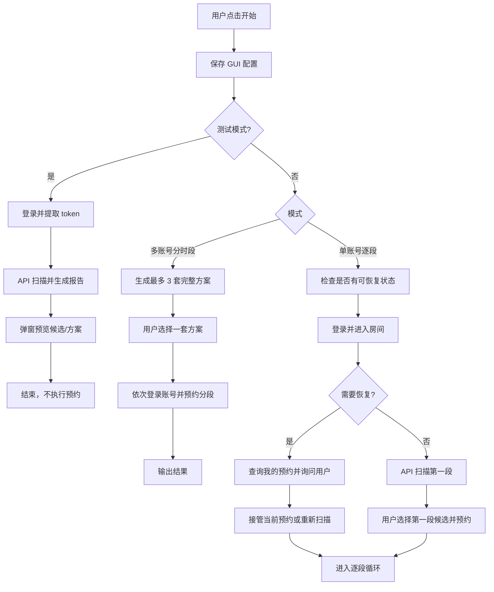
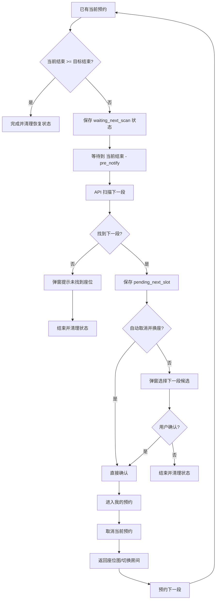
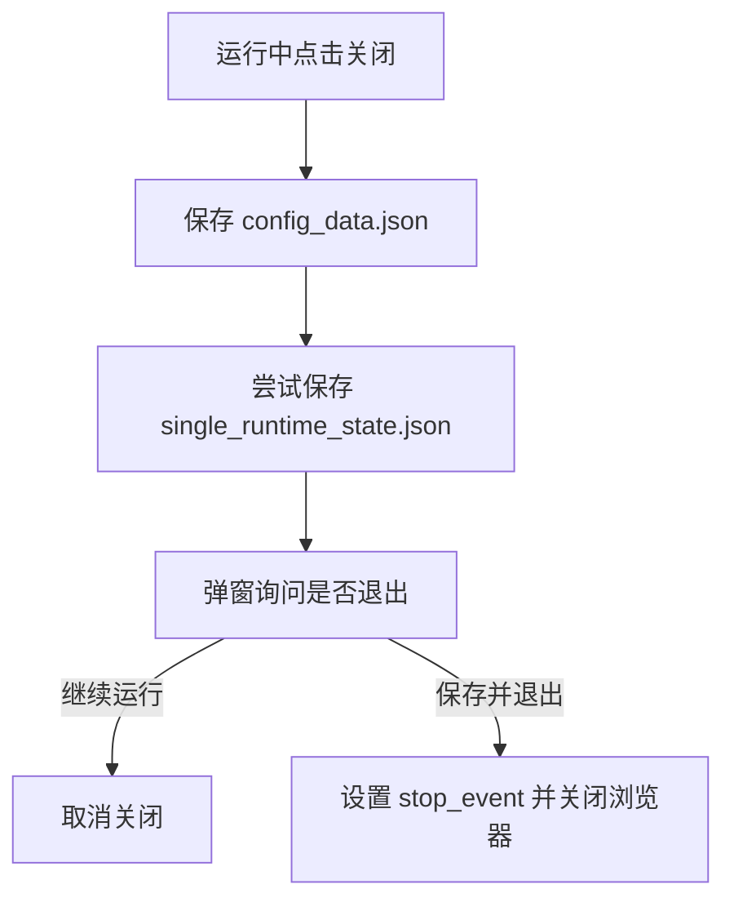
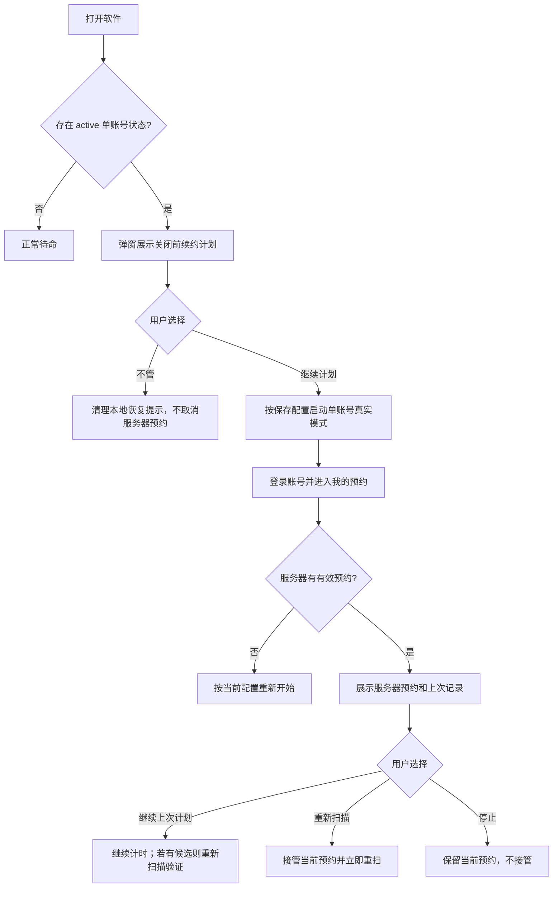

# 预约与恢复流程

[返回文档中心](README.md)

## 总控流程

```mermaid
flowchart TD
    A["用户点击开始"] --> B["保存 GUI 配置"]
    B --> C{"测试模式?"}
    C -- "是" --> D["登录并提取 token"]
    D --> E["API 扫描并生成报告"]
    E --> E2["弹窗预览候选/方案"]
    E2 --> Z1["结束，不执行预约"]

    C -- "否" --> F{"模式"}
    F -- "多账号分时段" --> G["生成最多 3 套完整方案"]
    G --> H["用户选择一套方案"]
    H --> I["依次登录账号并预约分段"]
    I --> Z2["输出结果"]

    F -- "单账号逐段" --> J["检查是否有可恢复状态"]
    J --> K["登录并进入房间"]
    K --> L{"需要恢复?"}
    L -- "是" --> M["查询我的预约并询问用户"]
    L -- "否" --> N["API 扫描第一段"]
    M --> O["接管当前预约或重新扫描"]
    N --> P["用户选择第一段候选并预约"]
    O --> Q["进入逐段循环"]
    P --> Q
```

## 单账号逐段循环

```mermaid
flowchart TD
    A["已有当前预约"] --> B{"当前结束 >= 目标结束?"}
    B -- "是" --> Z["完成并清理恢复状态"]
    B -- "否" --> C["保存 waiting_next_scan 状态"]
    C --> D["等待到 当前结束 - pre_notify"]
    D --> E["API 扫描下一段"]
    E --> F{"找到下一段?"}
    F -- "否" --> G["弹窗提示未找到座位"]
    G --> Z2["结束并清理状态"]
    F -- "是" --> H["保存 pending_next_slot"]
    H --> I{"自动取消并换座?"}
    I -- "否" --> J["弹窗选择下一段候选"]
    I -- "是" --> K["直接确认"]
    J --> L{"用户确认?"}
    L -- "否" --> Z3["结束并清理状态"]
    L -- "是" --> K
    K --> M["进入我的预约"]
    M --> N["取消当前预约"]
    N --> O["返回座位图/切换房间"]
    O --> P["预约下一段"]
    P --> A
```

## 关闭防误关

```mermaid
flowchart TD
    A["运行中点击关闭"] --> B["保存 config_data.json"]
    B --> C["尝试保存 single_runtime_state.json"]
    C --> D["弹窗询问是否退出"]
    D -- "继续运行" --> E["取消关闭"]
    D -- "保存并退出" --> F["设置 stop_event 并关闭浏览器"]
```

## 重启恢复

```mermaid
flowchart TD
    A["打开软件"] --> B{"存在 active 单账号状态?"}
    B -- "否" --> C["正常待命"]
    B -- "是" --> D["弹窗展示关闭前续约计划"]
    D --> E{"用户选择"}
    E -- "不管" --> F["清理本地恢复提示，不取消服务器预约"]
    E -- "继续计划" --> G["按保存配置启动单账号真实模式"]
    G --> H["登录账号并进入我的预约"]
    H --> I{"服务器有有效预约?"}
    I -- "否" --> J["按当前配置重新开始"]
    I -- "是" --> K["展示服务器预约和上次记录"]
    K --> L{"用户选择"}
    L -- "继续上次计划" --> M["继续计时；若有候选则重新扫描验证"]
    L -- "重新扫描" --> N["接管当前预约并立即重扫"]
    L -- "停止" --> O["保留当前预约，不接管"]
```

